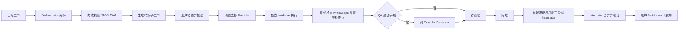

# 监制台：部署、调试与完整使用手册

本文对应 `software-project` 通用多 Agent Profile，适用于当前 V2 架构：

- Orchestrator 负责拆解目标并输出结构化任务 DAG；
- Backend、Frontend、Reviewer、Integrator 等角色与 AI 厂商解耦；
- Codex、Claude、Kimi 或其他 CLI Provider 可按能力与历史质量动态选择；
- 每张实弹工单使用独立 Git worktree，依赖任务通过检查点提交衔接；
- Integrator 完成后，由用户确认是否 fast-forward 发布到项目当前分支。

旧游戏开发流程仍可使用 `套件/studio.config.game.template.json`，但角色、动态路由和 worktree 章节以通用 Profile 为准。

---

## 1. 先理解三个目录

监制台会同时接触三类目录，排查问题时不要混淆。

| 目录 | 示例 | 保存内容 |
|---|---|---|
| 源码目录 | `C:\GitHub\AIworkflow-GameStudio` | `_app` 源码、测试、模板、打包脚本 |
| 监制台运行目录 | `%LOCALAPPDATA%\AIWorkflowStudio`（套件默认，可自选） | `studio.config.json`、工单状态目录、回执、流水、角色协议 |
| 被管理项目 | `D:\GitHub\MyProduct` | 你的前端、后端、测试等真实项目代码 |

实弹执行时还会创建第四类目录：工单 worktree。默认位置为：

```text
<监制台运行目录>\workspaces\<项目名>\<工单号>
```

对应分支名：

```text
studio/<项目名>/<工单号>
```

如果监制台运行目录位于被管理项目内部，系统会自动把 worktree 放到系统临时目录，避免嵌套 Git worktree。

---

## 2. 系统要求

### 2.1 必需项

- Windows 10/11 x64。便携 EXE 内含 Electron/Node；源码开发和构建才需要另装 Node.js LTS/npm。
- Git。建议使用较新的 Git for Windows，并确保 `git` 在 `PATH` 中。
- 至少一个已安装并登录的 Provider CLI。
- 从源码调试时需要 Node.js 和 npm；推荐使用能运行 Electron 30 的 Node.js 版本。

检查基础环境：

```powershell
git --version
node --version
npm --version
codex --version
claude --version
```

只使用 Claude 时可以不安装 Codex；只使用其他 Provider 时也可以关闭 Codex 和 Claude。配置中所有启用的 Provider 都会被环境探针检查。

### 2.2 被管理项目的 Git 要求

项目最好满足：

1. 项目路径存在；
2. 项目已初始化为 Git 仓库；
3. 至少有一个提交；
4. 开始任务前把希望 Agent 看见的基线提交到 Git；
5. 发布 Integrator 结果时，主工作区没有未提交改动。

worktree 从 `HEAD` 创建。主项目中未提交的文件不会自动出现在 Agent worktree 中。

尚未初始化的项目可执行：

```powershell
Set-Location 'D:\GitHub\MyProduct'
git init
git add .
git commit -m 'Initial baseline'
```

如果本机尚未配置 Git 身份，先按团队规范设置 `user.name` 和 `user.email`。

### 2.3 安全边界

worktree 解决的是并发 Agent 互相覆盖，不是安全沙箱。当前内置命令会以以下方式启动：

```text
codex exec --dangerously-bypass-approvals-and-sandbox ... -
claude -p --permission-mode acceptEdits ...
```

Provider CLI 仍是本机进程，只应注册允许 AI 访问的项目。不要把 API Key、Token 或密码写进工单、角色协议、回执或 `studio.config.json`。

---

## 3. 最快部署：使用便携套件

### 3.1 安装

发布套件的标准内容为：

```text
监制台-套件-vX.Y.Z.zip
  部署.bat
  SETUP.md
  完整使用手册.md
  监制台 X.Y.Z.exe
  骨架\
    studio.config.json
    角色协议\
    岗位协议\
    风格库\
```

部署步骤：

1. 解压 ZIP，不要直接在压缩包内运行。
2. 双击 `部署.bat`。
3. 输入运行目录，直接回车默认安装到桌面的 `AI工作室`。
4. 可立即注册第一个项目，也可直接回车，进入应用后再注册。
5. 部署脚本复制配置、角色协议和 EXE，然后自动启动。

部署完成后，最重要的验收标准是总览右上角的“环境”状态：

- `就绪`：已启用 Provider、项目、角色协议和目录均可用；
- `降级`：部分能力不可用，例如某个 Provider CLI 缺失、没有额度读数或项目非 Git；
- `阻断`：核心配置或凭据错误，需要先修复。

### 3.2 升级已有安装

使用新套件的 `部署.bat`，把安装目录指向原运行目录：

- 新 EXE 会覆盖旧 EXE；
- 已存在的 `studio.config.json` 不会覆盖；
- 原工单、回执、journal 和状态目录会保留；
- V1 配置不会自动改写成 V2，需要手工对照新模板迁移 Provider、角色、routing 和 workspace 字段。

升级前建议停止执行器、合上全局暂停闸门，并备份：

```text
studio.config.json
.studio-state.json
草稿/ 待投/ 池/ 在途/ 质检/ 待验收/ 待定夺/ 执行失败/ 完成/ 已归档/
回执/
journal/
角色协议/ 或 岗位协议/
```

还要备份被管理项目的 Git 仓库，因为工单检查点实际保存在项目的 `studio/*` 分支中。

### 3.3 卸载

1. 合上全局暂停闸门；
2. 等待在途 Agent 结束，关闭监制台；
3. 确认所有需要的 Integrator 结果已经发布或另行保留；
4. 删除监制台运行目录。

删除运行目录不会自动删除项目中的 `studio/*` 分支和外部 worktree。清理前先使用：

```powershell
git -C 'D:\GitHub\MyProduct' worktree list
git -C 'D:\GitHub\MyProduct' branch --list 'studio/*'
```

只有在工单已完成、改动已发布或确认不再需要，并且 worktree 没有未提交内容时，才手工移除对应 worktree 和分支。

---

## 4. 从源码启动

### 4.1 安装依赖

在仓库的 `_app` 目录执行：

```powershell
Set-Location 'C:\GitHub\AIworkflow-GameStudio\_app'
npm install
```

需要安装的主要运行依赖是 Express、gray-matter、marked、sanitize-html，以及开发期 Electron、electron-builder。

项目以 `package-lock.json` 和 npm 为标准构建方式。也支持 pnpm：仓库内的 `pnpm-workspace.yaml` 已固定为
Electron Builder 可打包的提升式依赖布局，并只允许 Electron 运行安装脚本；不要删除这份配置。

安装验证：

```powershell
.\node_modules\electron\dist\electron.exe --version
```

### 4.2 建立独立开发运行目录

不要为了调试把真实工单状态写进源码目录。建议新建一个运行目录：

```powershell
$studioDevRoot = Join-Path $env:USERPROFILE 'AIStudioDev'
New-Item -ItemType Directory -Force $studioDevRoot
Copy-Item 'C:\GitHub\AIworkflow-GameStudio\套件\studio.config.template.json' "$studioDevRoot\studio.config.json"
Copy-Item 'C:\GitHub\AIworkflow-GameStudio\套件\角色协议模板' "$studioDevRoot\角色协议" -Recurse -Force
```

服务启动后会自动创建所有工单状态目录、`回执` 和 `journal`。

### 4.3 只启动 Web 服务

```powershell
$env:STUDIO_ROOT = Join-Path $env:USERPROFILE 'AIStudioDev'
Set-Location 'C:\GitHub\AIworkflow-GameStudio\_app'
npm run start
```

浏览器打开：

```text
http://127.0.0.1:4270
```

这是最适合后端和 API 调试的方式。服务只监听 `127.0.0.1`，不会对局域网开放。

### 4.4 启动 Electron 桌面壳

```powershell
$env:STUDIO_ROOT = Join-Path $env:USERPROFILE 'AIStudioDev'
Set-Location 'C:\GitHub\AIworkflow-GameStudio\_app'
npm run desktop
```

桌面调试时可尝试 `Ctrl+Shift+I` 打开 Chromium DevTools。界面问题也可以直接用浏览器访问本机服务调试。

### 4.5 `STUDIO_ROOT` 的作用

配置根目录解析顺序为：

1. 环境变量 `STUDIO_ROOT`；
2. 便携 EXE 的 `PORTABLE_EXECUTABLE_DIR`；
3. 从源码所在位置向上查找 `studio.config.json`。

源码调试推荐始终显式设置 `STUDIO_ROOT`，避免误读其他安装目录。

### 4.6 PowerShell 提示“无法识别 npm”

这表示系统没有安装带 npm 的 Node.js，或安装目录不在 `PATH`。先检查：

```powershell
Get-Command node,npm -ErrorAction SilentlyContinue
```

长期开发建议安装带 npm 的 Node.js，并在安装后重新打开 PowerShell。

不要依赖 Codex 桌面应用内部附带的 Node 路径：该路径包含本机用户名、版本号和缓存目录，升级或换机器后
都可能变化。源码开发应安装 Node.js LTS（自带 npm），或者使用团队统一的 Node 版本管理工具。

启动 Electron：

```powershell
$env:STUDIO_ROOT = Join-Path $env:USERPROFILE 'AIStudioDev'
Set-Location '<你的仓库路径>\AIworkflow-GameStudio\_app'
& .\node_modules\electron\dist\electron.exe .
```

---

## 5. 从源码构建便携 EXE 和安装套件

### 5.1 运行测试

```powershell
Set-Location 'C:\GitHub\AIworkflow-GameStudio\_app'
npm test
```

也可以单独运行某组测试：

```powershell
node test/routing.test.js
node test/orchestration.test.js
node test/worktree.test.js
node test/runner.test.js
```

worktree 测试会在系统临时目录创建并清理测试 Git 仓库，不会修改已注册项目。

### 5.2 构建 EXE

```powershell
Set-Location 'C:\GitHub\AIworkflow-GameStudio\_app'
npm run dist
```

当前 `package.json` 使用项目内相对输出目录：

```text
<仓库>\_app\dist
```

打包脚本会读取 `package.json` 自动找到该目录，不依赖机器盘符。也可以通过
`打包套件.ps1 -ExePath <路径> -OutputDirectory <目录>` 显式指定已有 EXE 和压缩包输出位置。

### 5.3 打包一键部署套件

确认构建目录中存在与 `_app/package.json` 版本一致的：

```text
监制台 <version>.exe
```

然后运行：

```powershell
Set-Location 'C:\GitHub\AIworkflow-GameStudio'
powershell -ExecutionPolicy Bypass -File '.\套件\打包套件.ps1'
```

产物默认写到项目构建目录，避免桌面被 OneDrive 或企业策略保护时写入失败：

```text
<仓库>\_app\dist\package\监制台-套件-v<version>.zip
```

需要放到其他目录时使用 `-OutputDirectory <目录>`。打包脚本会重新生成干净骨架，不会把当前开发环境的
工单、回执、凭据或风格库内容打进分发包。

---

## 6. 首次配置

### 6.1 注册项目

进入右上角设置，或从多项目启动页选择“注册新项目”。填写：

- 项目名：中文、字母、数字、下划线或横线，最多 24 位；
- 绝对路径：建议指向 Git 仓库根目录；
- 说明：可选；
- 默认项目：新工单默认归属。

多项目共享同一组 Provider、Agent 编制、额度锁和暂停闸门，但工单按 `项目` 字段过滤。

不能删除仍被未完成工单引用的项目。

### 6.2 检查角色

通用 Profile 默认角色：

| 角色 | 职责 |
|---|---|
| `orchestrator` | 分析仓库、拆解任务、建立依赖、接口契约和写入范围 |
| `backend` | 服务端、数据、接口和后端测试 |
| `frontend` | 页面、交互、状态管理和前端测试 |
| `reviewer` | 跨 Provider 只读评审 |
| `integrator` | 合并依赖、处理冲突、运行项目级验证 |

对应协议位于运行目录的 `角色协议/`。协议是提示词的一部分，保存后下一张任务立即生效；不需要重新构建应用。

### 6.3 检查 Agent 编制

默认每个角色一名 Agent。编制数就是最大并发数；每名 Agent 同时只持一张工单。

每个 Agent 可设置：

- `routing.mode = auto`：每次领单动态选择 Provider；
- 固定 Provider：始终使用指定厂商；
- 个体模型：覆盖该 Provider 的默认模型。

建议初次使用保持所有 Agent 为“自动择优”，只有调试或专项任务才固定 Provider。

### 6.4 先使用试跑

新运行目录默认处于试跑模式：

- 不调用任何 AI CLI；
- 不消耗额度；
- 工单状态、领单、QA、验收和 Orchestrator 子单物化仍会模拟运行；
- 试跑 Orchestrator 使用内置演示计划，不代表真实拆解质量。

确认状态流转、项目过滤和参数页都正常后，再解锁实弹。

---

## 7. Provider 配置与动态择优

### 7.1 内置 Adapter

| Adapter | 用途 | 默认调用 |
|---|---|---|
| `codex-cli` | Codex CLI | `codex exec ... -`，提示词走 stdin |
| `claude-cli` | Claude Code | `claude -p ...`，提示词走 stdin |
| `command-cli` | Kimi 或其他厂商 CLI | 命令和参数完全由配置声明，提示词走 stdin |

### 7.2 Codex 示例

```json
"codex": {
  "adapter": "codex-cli",
  "enabled": true,
  "defaultModel": "",
  "capabilities": ["planning", "repository-navigation", "coding", "backend", "frontend", "code-review"],
  "scores": {
    "default": { "quality": 70, "latency": 50, "cost": 50 }
  },
  "quota": { "阈值": 70, "周阈值": 90 }
}
```

`defaultModel` 为空表示使用 CLI 自带默认模型。也可以增加绝对命令路径：

```json
"command": "C:/Users/you/AppData/Roaming/npm/codex.cmd"
```

### 7.3 Claude 示例

```json
"claude": {
  "adapter": "claude-cli",
  "enabled": true,
  "defaultModel": "sonnet",
  "capabilities": ["planning", "repository-navigation", "coding", "backend", "frontend", "code-review"],
  "scores": {
    "default": { "quality": 70, "latency": 50, "cost": 50 }
  },
  "quota": { "阈值": 50, "周阈值": 90 }
}
```

Claude Adapter 会依次尝试常见的 `claude.cmd`、`~/.local/bin/claude.exe` 和 PATH 中的 `claude`。路径特殊时显式设置 `command`。

### 7.4 Kimi 或其他厂商

模板中 Kimi 默认关闭，因为不同 CLI 的实际参数可能不同：

```json
"kimi": {
  "adapter": "command-cli",
  "enabled": false,
  "command": "kimi",
  "args": [],
  "modelArgs": ["--model", "{model}"],
  "defaultModel": "",
  "models": [],
  "capabilities": ["planning", "repository-navigation", "coding", "backend", "frontend", "code-review"]
}
```

接入步骤：

1. 在 PowerShell 中确认厂商 CLI 能读取 stdin 并以退出码 `0` 表示成功；
2. 填写 `command` 和固定 `args`；
3. 用 `{model}` 配置 `modelArgs`；
4. 可设置 `probeCommand`、`probeArgs` 供环境页执行版本探测；
5. 先直接在终端验证，再把 `enabled` 改为 `true`；
6. 重启监制台。

如果 CLI 不支持 stdin，需要提供一个本地包装脚本，把 stdin 转成该 CLI 所需格式。

敏感凭据应由 CLI 登录态或系统环境变量提供。虽然 `command-cli` 支持 `env` 字段，但不要在明文配置中放密钥。

### 7.5 动态路由如何判断“当前最优”

路由顺序：

1. 排除未启用、被 deny、角色不允许或缺少硬能力的 Provider；
2. 如果工单或 Agent 固定了 Provider，直接使用固定值；
3. 其余候选按配置分和近期真实结果排序；
4. Reviewer 默认优先选择不同于实现方的 Provider；
5. 一张工单开工后不在执行中途切换 Provider，失败重投或下一张工单会重新评分。

默认权重：

```json
"weights": {
  "quality": 0.5,
  "success": 0.3,
  "latency": 0.1,
  "cost": 0.1
}
```

配置分均按 `0–100` 理解，数值越高越好：

- `quality` 越高表示你认为质量越好；
- `latency` 越高表示越快；
- `cost` 越高表示越省；
- `success` 来自本机真实执行和评审记录，不在配置中手填。

可按角色提供不同初始分：

```json
"scores": {
  "default": { "quality": 65, "latency": 70, "cost": 80 },
  "backend": { "quality": 90, "latency": 55, "cost": 50 },
  "frontend": { "quality": 70, "latency": 65, "cost": 50 }
}
```

真实评审结论优先于单纯 CLI 退出码。历史保存在：

```text
<运行目录>\journal\provider-runs.jsonl
```

在参数页可以查看每个角色的候选排序。只修改 `studio.config.json` 中的 capabilities、scores、routing 等非 UI 字段时，需要重启应用。

### 7.6 厂商升级后如何快速切换

当某个厂商发布更强模型时：

1. 先在 `models` 或“可选模型”中加入模型名；
2. 更新该 Provider 的 `defaultModel` 或单个 Agent 模型；
3. 调高相应角色的 `scores.<role>.quality`；
4. 用几张低风险、带客观验收标准的任务验证；
5. 让跨 Provider Reviewer 评审；
6. 观察 `/api/providers` 和 `provider-runs.jsonl`，再决定是否全面切换。

系统会根据本机任务表现继续调整，但不会自动从互联网得知厂商发布了新模型。当前版本仍需要你更新模型名和初始质量判断。

---

## 8. 执行控制：暂停、试跑与实弹

三个控制的含义不同：

| 控制 | 作用 |
|---|---|
| 执行器启动/停止 | 控制当前会话是否继续扫描；程序重启后执行器会自动启动 |
| 暂停闸门 | 阻止领取新工单；在途任务继续跑完。全局暂停是长期“不要开新工”的正确方式 |
| 实弹解锁 + 执行模式 | 解锁只是授权；切到实弹后才真正调用 Provider CLI |

重要行为：

- 关闭窗口不会取消已经发生的额度消耗，也不要假定 Windows 会自动终止所有外部 CLI 子进程；不要把关窗当作取消任务或事务回滚。
- `.studio-state.json` 会保留试跑/实弹状态。
- 如果上次是实弹且配置仍为解锁，重启后执行器会恢复并自动扫描。
- 长时间离开前应合上全局暂停闸门，必要时重新锁定实弹。
- “停止执行器”只影响本次会话，重启应用会再次自动启动。

推荐安全顺序：

1. 全局暂停；
2. 注册和检查项目；
3. 试跑一张任务；
4. 检查环境页；
5. 打开实弹解锁；
6. 切换执行模式到实弹；
7. 确认工单后解除全局暂停。

---

## 9. 完整生产流程



### 9.1 创建目标工单

进入工单池，点击“起草”。建议第一张目标单选择：

- 角色：`orchestrator`；
- 项目：目标项目；
- 验收方式：初次使用建议“保留”；
- QA：可关闭，Orchestrator 的核心产物会由内核校验；
- 正文：写清目标、不能做什么、技术约束和最终验收标准。

工单编号格式示例：

```text
APP-1
MYPROJECT-12
甲-01
```

保存为待投后，再点击“投池”。投池是人工放行点。

### 9.2 Orchestrator 输出与子单

实弹 Orchestrator 会被要求把 JSON 计划写入项目内 `.studio/plan.json`，并在最终回复附带同一份 JSON。
平台优先读取最终回复；回复缺少或截断 JSON 时会自动读取计划文件。Provider 的原始回复另存为
`回执/<工单号>.provider-output.md`，因此解析失败后仍有诊断依据。核心结构：

```json
{
  "summary": "先契约，再并行前后端，最后集成",
  "tasks": [
    {
      "key": "backend",
      "title": "实现用户 API",
      "role": "backend",
      "description": "实现接口和测试",
      "dependsOn": [],
      "requiredCapabilities": ["coding", "backend"],
      "writeScope": ["server/**", "tests/backend/**"],
      "acceptance": ["接口测试全部通过"],
      "qa": true,
      "acceptanceMode": "委托"
    }
  ]
}
```

内核会拒绝：

- 未知角色；
- 重复或非法 key；
- 未知依赖；
- 自依赖或循环依赖；
- 空验收标准；
- 超过 `orchestration.maxTasks`；
- 默认情况下递归创建新的 Orchestrator。

通过后生成稳定编号：

```text
父单 APP-1
子单 APP-1-1
子单 APP-1-2
子单 APP-1-3
```

子单先进入“待投”，不会自动烧额度。你应检查标题、依赖、角色、写入范围和验收标准，再逐张投池。
每张子单还会自动依赖父 Orchestrator 工单：父单验收完成后，子单才能被领取，并会在独立 worktree
中自动纳入父单的计划文档和 Git 检查点。

### 9.3 推荐的 DAG 结构

典型全栈任务：

```text
接口契约
  ├─ 后端实现
  └─ 前端实现
       \     /
        Reviewer（可选独立评审单）
             |
         Integrator
```

原则：

- 前后端都依赖接口契约；
- 共享配置和高冲突文件交给 Integrator，或通过依赖串行化；
- Integrator 必须依赖所有需要发布的实现任务；
- 依赖工单只有进入“完成”后才算满足，不是“交付”或“待验收”就算满足；
- 想自动走到底，可把客观任务设为“委托验收”；需要品味或架构拍板的任务保留人工验收。

### 9.4 worktree 执行

实弹 Agent 开工时：

1. 系统创建或复用 `studio/<project>/<ticket>` 分支；
2. 创建独立 worktree；
3. 有依赖时先合并上游检查点；
4. 把 worktree 作为 Provider CLI 的当前目录；
5. Agent 完成后检查冲突和写入范围；
6. 系统统一创建检查点提交；
7. 工单进入 QA 或待验收。

不要要求普通 Agent 自己切分支、推送、rebase 或重写历史。系统负责检查点。

### 9.5 `writeScope`

`writeScope` 使用相对项目根目录的简单 glob：

```json
["server/**", "tests/backend/**", "package.json"]
```

支持：

- `*`：单层任意字符；
- `**`：跨目录；
- `?`：单个字符。

非 Integrator Agent 修改范围外文件时，系统会拒绝检查点并把工单送入执行失败分诊。没有声明 `writeScope` 时不做路径级硬限制，仍受工单正文和角色协议约束。

### 9.6 QA 与验收

QA 开启时：

1. 实现 Agent 交付；
2. 工单进入“质检”；
3. Reviewer 优先使用不同 Provider，读取同一个实现 worktree；
4. 通过后进入“待验收”；
5. 不通过则回在途自修，超过上限进入待定夺。

验收方式：

- `委托`：Auditor 按验收标准核验，通过后自动进入完成；
- `保留`：必须由用户在决策台终审。

验收打回不会复活旧单，而是归档旧单；需要返工时另开新单，并通过“返工自”字段保留追溯链。

### 9.7 Integrator 与发布

Integrator 开工前自动合并依赖检查点：

- 无冲突：继续执行项目级测试和验收；
- 普通角色发生依赖冲突：中止该次冲突合并并进入失败分诊；
- Integrator 发生冲突：冲突现场保留在自己的 worktree，提示词会列出冲突文件并授权处理。

Integrator 验收完成后，详情页显示“发布到项目”。发布条件：

1. 工单角色是 `integrator`；
2. 工单状态为“完成”；
3. 有有效 Git 检查点；
4. 项目主工作区干净；
5. 项目当前 `HEAD` 是 Integrator 提交的祖先，可安全 fast-forward。

任何分叉都会拒绝发布，不会在主项目留下冲突现场。此时应基于新 `HEAD` 新建或重跑 Integrator。

发布不会自动 push 远端。检查无误后仍由你按项目规范执行 push 或创建 PR。

---

## 10. 工单状态与人工动作

状态主链：

```text
草稿 → 待投 → 池 → 在途 → 质检 → 待验收 → 完成
                       │       │
                       ├→ 执行失败
                       └→ 待定夺
```

各状态含义：

| 状态 | 含义 | 常用动作 |
|---|---|---|
| 草稿 | 尚未定稿 | 编辑、定稿、废弃 |
| 待投 | 已定稿但未放行 | 投池、撤回 |
| 池 | 等待 Agent 领取 | 撤回、暂停闸门 |
| 在途 | Agent 正在执行或等待恢复 | 收回、等待、废弃 |
| 质检 | 等待 Reviewer | 等待 QA |
| 待验收 | 产出已交回 | 验收通过/打回，或委托代核 |
| 待定夺 | QA 多次不过或失败上呈 | 给方向、接受、人工处理 |
| 执行失败 | CLI、超时、工作区或收尾失败 | 重投、上呈、废弃 |
| 完成 | 已验收终态 | Integrator 可发布；其他单只读保留 |
| 已归档 | 废弃或打回终态 | 只读追溯 |

执行失败重投后会重新参与 Provider 评分；原 worktree 通常保留，新的 Provider 可以继续诊断已有改动。

---

## 11. 配置文件参考

配置唯一事实源：

```text
<运行目录>\studio.config.json
```

UI 能修改常用字段；手工修改其他字段后应重启应用。

### 11.1 顶层分区

| 字段 | 作用 |
|---|---|
| `schemaVersion` | 配置版本，通用 Profile 为 2 |
| `profile` | `software-project` 或旧 `game-studio` |
| `server` | 本地 HTTP 端口 |
| `职能` / `roles` | 角色全集、显示名和硬能力 |
| `providers` | Provider Adapter、模型、能力、评分和额度阈值 |
| `routing` | 动态路由权重、角色偏好、allow/deny、跨 Provider 评审 |
| `orchestration` | Orchestrator 最大子任务数、是否允许嵌套 |
| `workspace` | worktree、检查点和依赖集成策略 |
| `stages` | PLAN/BUILD/VERIFY 等阶段字典 |
| `闸值` | 验收积压、QA 自修、滞留告警 |
| `执行器` | 扫描周期、试跑、实弹解锁、超时和自动记账 |
| `模型` | 兼容模型默认值和 UI 可选模型 |
| `项目` | 多项目注册表和默认项目 |
| `agents` | 编制、角色、自动或固定 Provider、个体模型 |

### 11.2 Orchestrator

```json
"orchestration": {
  "maxTasks": 20,
  "allowNested": false
}
```

通常不要打开嵌套 Orchestrator，避免递归拆单失控。

### 11.3 Worktree

```json
"workspace": {
  "mode": "worktree",
  "root": "workspaces",
  "branchPrefix": "studio",
  "baseRef": "HEAD",
  "autoCommit": true,
  "integrateDependencies": true,
  "allowMissingDependencies": false,
  "requireGit": false
}
```

字段说明：

- `mode=worktree`：Git 项目使用隔离 worktree；`direct` 表示直接在项目目录执行；
- `root`：绝对路径，或相对监制台运行目录；
- `branchPrefix`：工单分支前缀；
- `baseRef`：新工单分支基线；
- `autoCommit`：完工后自动检查点；
- `integrateDependencies`：下游开工前合并上游提交；
- `allowMissingDependencies=false`：没有上游检查点时拒绝在旧基线开工；
- `requireGit=true`：项目非 Git 时直接报错；为 false 时降级 direct。

有依赖的生产流程不建议关闭 `autoCommit`，否则下游没有可合并的检查点。

### 11.4 执行器

```json
"执行器": {
  "间隔秒": 15,
  "试跑耗时秒下限": 3,
  "试跑耗时秒上限": 8,
  "实弹解锁": false,
  "执行超时分钟": 30,
  "记账间隔分钟": 10,
  "质检耗时秒下限": 2,
  "质检耗时秒上限": 5
}
```

超时后 Windows 会终止 Provider CLI 进程树，并把工单送入执行失败。

### 11.5 网络代理

解析优先级：

1. 当前进程 `HTTPS_PROXY` / `HTTP_PROXY`；
2. 系统注册表中的代理；
3. `网络.代理默认`。

不需要代理时把默认值设为空：

```json
"网络": { "代理默认": "" }
```

NordVPN 等系统级 VPN 通常不提供 `127.0.0.1:7890` 这类 HTTP 代理端口，应保持为空。未配置代理时
环境页显示“系统直连/VPN”，属于正常就绪状态。只有明确使用 Clash、V2Ray 等本地代理并确认监听端口后，
才填写代理地址。

代理值会传给 Provider 子进程。

---

## 12. 调试入口

### 12.1 浏览器和服务端

源码调试推荐同时打开：

- PowerShell：查看服务启动、代理注入、端口和未捕获错误；
- 浏览器 DevTools：查看前端 Console 和 Network；
- 运行目录：查看工单、回执和 journal；
- 被管理项目：查看 worktree、分支和 Git 状态。

前端文件：

```text
_app/public/index.html
_app/public/app.js
_app/public/style.css
```

服务和业务入口：

```text
_app/server.js
_app/lib/runner.js
_app/lib/routing/router.js
_app/lib/orchestration/plan.js
_app/lib/workspace/worktree.js
```

### 12.2 常用只读 API

```powershell
$studioBaseUrl = 'http://127.0.0.1:4270'

Invoke-RestMethod "$studioBaseUrl/api/env?force=1"
Invoke-RestMethod "$studioBaseUrl/api/runner"
Invoke-RestMethod "$studioBaseUrl/api/runner/trace?id=APP-1"
Invoke-RestMethod "$studioBaseUrl/api/providers"
Invoke-RestMethod "$studioBaseUrl/api/board"
Invoke-RestMethod "$studioBaseUrl/api/agents"
Invoke-RestMethod "$studioBaseUrl/api/journal"
Invoke-RestMethod "$studioBaseUrl/api/ticket?id=APP-1"
```

用途：

- `/api/env?force=1`：绕过 60 秒缓存重新探测 CLI、凭据、项目和协议；
- `/api/runner`：查看执行器模式、正在运行的 Agent、Provider 和 worktree；
- `/api/runner/trace?id=<工单号>`：查看该工单本次会话的实时 Provider 输出、错误和最近活动时间；
- `/api/providers`：查看角色候选排序、评分原因和最近运行历史；
- `/api/board`：查看全部状态工单；
- `/api/ticket`：查看完整 frontmatter、正文、追溯链和回执。

### 12.3 紧急暂停 API

界面无法操作但服务仍在时，可从本机 PowerShell 合上全局暂停闸门：

```powershell
$studioBaseUrl = 'http://127.0.0.1:4270'
$pauseBody = @{ scope = 'global'; value = $true } | ConvertTo-Json
Invoke-RestMethod -Method Post -Uri "$studioBaseUrl/api/gate/pause" -ContentType 'application/json' -Body $pauseBody
```

这只阻止新任务领取，不会终止已经运行的 Provider 进程。

### 12.4 日志和事实源

| 文件 | 内容 |
|---|---|
| `journal/YYYY-MM.log` | 起草、领单、执行、QA、发布、配置修改等操作流水 |
| `journal/provider-runs.jsonl` | Provider、角色、耗时、执行结果和评审结果 |
| `回执/<工单号>.md` | Agent 完工报告、QA、代核、代裁内容 |
| `<状态目录>/<工单号>.md` | 工单 frontmatter 和正文，是工单唯一事实源 |
| `.studio-state.json` | 暂停状态、执行器运行/试跑状态等本地状态 |

点击任意工单进入详情页，可展开“AI 实时输出与工具轨迹”。Codex 使用官方 JSONL 事件流，Claude 使用
官方 `stream-json` 事件流；面板每秒刷新，显示普通回复、命令、文件变更、工具结果、错误和距上次活动时间。
模型未公开的内部思维链不会展示。

实时轨迹只保存在应用内存，每张单最多保留最近约 20 万字符，并会遮蔽常见密钥格式；重启应用后清空。
最终回执和截断后的失败原因仍按原规则落盘。需要跨重启的完整厂商诊断时，应使用厂商 CLI 自带日志，且
不要把密钥写入日志。

### 12.5 Git 调试

查看所有工单 worktree：

```powershell
git -C 'D:\GitHub\MyProduct' worktree list --porcelain
```

查看分支：

```powershell
git -C 'D:\GitHub\MyProduct' branch --list 'studio/*'
```

查看某张工单：

```powershell
$studioRoot = Join-Path $env:USERPROFILE 'AIStudioDev'
git -C (Join-Path $studioRoot 'workspaces\MyProduct\APP-1-1') status
git -C (Join-Path $studioRoot 'workspaces\MyProduct\APP-1-1') log --oneline --decorate -10
```

检查 Integrator 是否可快进发布：

```powershell
git -C 'D:\GitHub\MyProduct' merge-base --is-ancestor HEAD '<integrator-commit>'
$LASTEXITCODE
```

退出码 `0` 表示祖先关系成立；仍需保证主项目工作区干净。

### 12.6 直接验证 Provider CLI

在低风险临时 Git 仓库中验证 stdin 和退出码：

```powershell
'只回复 OK，不修改文件' | codex exec --dangerously-bypass-approvals-and-sandbox -
'只回复 OK，不修改文件' | claude -p --permission-mode acceptEdits
$LASTEXITCODE
```

不要在真实项目中用危险权限做无边界测试。

### 12.7 配置 JSON 校验

```powershell
Get-Content -Raw "$env:USERPROFILE\AIStudioDev\studio.config.json" | ConvertFrom-Json | Out-Null
```

服务能容忍 UTF-8 BOM，但不能容忍注释、尾逗号或非法 JSON。

### 12.8 JavaScript 语法检查

```powershell
node --check .\_app\server.js
node --check .\_app\lib\runner.js
node --check .\_app\lib\workspace\worktree.js
node --check .\_app\public\app.js
```

---

## 13. 常见故障

### 13.1 启动提示缺少 `studio.config.json`

原因：没有找到运行根目录。

处理：

- 便携版确认 EXE 与 `studio.config.json` 在同一安装目录；
- 源码调试设置 `$env:STUDIO_ROOT`；
- 用 `ConvertFrom-Json` 检查配置。

### 13.2 端口占用

症状：服务启动报 `EADDRINUSE`。

处理：修改 `server.port` 为 `1024–65535` 的空闲端口，然后重启。端口修改不会热生效。

### 13.3 环境页显示 Provider 未安装

检查：

```powershell
where.exe codex
where.exe claude
codex --version
claude --version
```

GUI 进程的 PATH 可能与终端不同。最稳妥的做法是在 Provider 配置中填绝对 `command` 路径，重启后访问 `/api/env?force=1`。

### 13.4 Claude 凭据红灯

按 Claude CLI 的登录方式重新登录，然后强制刷新环境探针。监制台读取 CLI 已有登录态，不应手工把 token 写入配置。

### 13.5 Codex 额度或登录态不可见

先确认：

```powershell
codex --version
codex app-server
```

如果 `app-server` 无响应，环境页会显示额度盲飞。动态执行是否可用仍以直接运行一次低风险 Codex 任务为准。

### 13.6 工单一直在池中

依次检查：

1. 执行器是否运行；
2. 是否合上全局或 Provider 暂停闸门；
3. Provider 是否触发额度锁；
4. 是否有对应角色的在线 Agent；
5. Agent 是否已持有另一张工单；
6. 工单依赖是否全部“完成”；
7. 工单是否标记“待复核”；
8. 角色所需能力是否有 Provider 满足；
9. 实弹模式是否已解锁。

查看 `/api/runner`、`/api/providers` 和 `journal` 通常可以定位原因。

### 13.7 工单进入执行失败

查看工单详情的：

- `失败原因`；
- `失败次数`；
- `workspace.path`、`workspace.branch`、`workspace.commit`；
- 回执；
- journal 对应时间。

常见原因：

- CLI 非零退出；
- 命令或模型名错误；
- 超时；
- 项目路径失效；
- worktree 创建失败；
- 依赖缺少检查点；
- 非 Integrator 发生依赖冲突；
- `writeScope` 越界；
- Orchestrator JSON 计划非法；
- 收尾提交或状态流转失败。

处理动作：

- `重投`：回池重新评分和执行；
- `上呈`：进入待定夺人工判断；
- `废弃`：归档；
- 必要时新建修复或 Integrator 工单。

### 13.8 worktree 目录已存在但无法使用

先不要直接删除。检查：

```powershell
git -C 'D:\GitHub\MyProduct' worktree list --porcelain
git -C '<报错中的工作区路径>' status
```

可能是上次异常退出留下的目录、worktree 登记不一致或同名分支在别处被检出。确认没有需要保留的改动后，再按 Git 标准流程修复或移除。

### 13.9 Integrator 无法发布

错误“项目主工作区有未提交改动”：

```powershell
git -C 'D:\GitHub\MyProduct' status
```

先自行提交、暂存到其他位置或处理这些改动。

错误“项目基线已前进”：主分支在 Integrator 创建后出现了新提交。不要强行 merge；新建或重跑 Integrator，使其基于最新 `HEAD` 集成。

### 13.10 `writeScope` 越界

工单会列出越界文件。处理选择：

- 如果确实不该改：让 Agent 回滚越界内容后重投；
- 如果范围设计错误：撤回或新建工单，修正 `write_scope`；
- 如果是共享文件：交给 Integrator；
- 不建议为了省事删除所有写入范围限制。

### 13.11 Orchestrator 没有生成子工单

查看父单失败原因。常见问题：

- 没有输出 JSON 代码块；
- JSON 中没有 `tasks` 数组；
- 角色不在 `roles` 中；
- 依赖 key 拼错；
- 任务成环；
- 验收标准为空；
- 子任务超过上限。

修正目标描述或 Provider 模型后重投。Orchestrator 输出只有全部校验通过才会落子单，避免半套计划污染状态机。

### 13.12 `.studio-state.lock` 锁超时

系统会自动回收超过 15 秒的陈旧锁。先等待一次重试。只有确认所有监制台进程都已退出后，才考虑手工处理残留锁目录；不要在应用运行时删除锁。

---

## 14. 数据维护与恢复

### 14.1 工单可以手工查看，但不要随意移动

工单是带 YAML frontmatter 的 Markdown 文件。所在目录就是状态，手工跨目录移动相当于绕过状态机。

需要手工修复时：

1. 合上全局暂停；
2. 关闭监制台；
3. 备份运行目录；
4. 修复单个文件；
5. 检查同一编号是否只存在于一个状态目录；
6. 重启并查看 `/api/board`。

### 14.2 自动记账

如果监制台运行目录本身位于 Git 仓库中，系统会按 `执行器.记账间隔分钟` 定期提交工单目录、回执、journal、协议和风格库。

它只 commit，不 push；也不会把被管理项目的代码提交混进监制台账本。

### 14.3 推荐备份策略

同时备份：

- 监制台运行目录；
- 每个被管理项目 Git 仓库；
- 尚未推送的 `studio/*` 分支；
- 外部 worktree 中尚未形成检查点的改动。

只备份运行目录不足以恢复项目代码；只备份项目仓库也不足以恢复工单状态和回执。

---

## 15. 推荐的日常操作清单

### 每次开工前

- [ ] 主项目希望 Agent 看见的改动已提交；
- [ ] 环境页无阻断；
- [ ] Provider 模型和评分符合当前判断；
- [ ] 全局暂停仍保持，先检查待投工单；
- [ ] DAG 依赖和 Integrator 覆盖完整；
- [ ] `writeScope` 没有遗漏必要文件；
- [ ] 确认试跑或实弹模式；
- [ ] 解除暂停闸门。

### 每次发布前

- [ ] Backend/Frontend 等依赖单均已完成；
- [ ] Integrator 已完成项目级测试；
- [ ] Reviewer 或人工验收已通过；
- [ ] 主项目 `git status` 干净；
- [ ] 主项目没有 Integrator 未包含的新提交；
- [ ] 点击“发布到项目”；
- [ ] 本地复验；
- [ ] 按团队流程 push 或创建 PR。

### 每次收工前

- [ ] 合上全局暂停闸门；
- [ ] 检查在途、执行失败、待定夺；
- [ ] 检查未发布 Integrator；
- [ ] 检查 `studio/*` 分支和 worktree 磁盘占用；
- [ ] 备份或 push 重要提交；
- [ ] 长期停用时重新锁定实弹。

---

## 16. 当前限制

- 正式支持 Windows 10/11 x64；分发包已覆盖无 Node/npm、中文及空格安装路径。macOS、Linux 和 Windows ARM
  目前没有原生包。
- Provider 目前以 CLI Adapter 为主，尚无通用远程 API Adapter 和安全凭据引用层。
- 系统根据本地配置和历史评审选择最优 Provider，但不会自动感知互联网中的新模型发布。
- 执行失败不会自动无限换厂商；重投会重新评分，自动 fallback 和预算上限仍是后续能力。
- worktree 和 `studio/*` 分支不会自动清理。
- 主项目发布只允许 fast-forward，不自动创建 PR、不 push。
- Provider 实时轨迹仅保存在当前应用内存，不跨重启持久化；深度排查仍需厂商 CLI 日志。
- `writeScope` 是 Git 文件路径约束，不是操作系统权限沙箱。

架构和后续计划见 [V2 通用多 Agent 重构](V2通用多Agent重构.md)。
